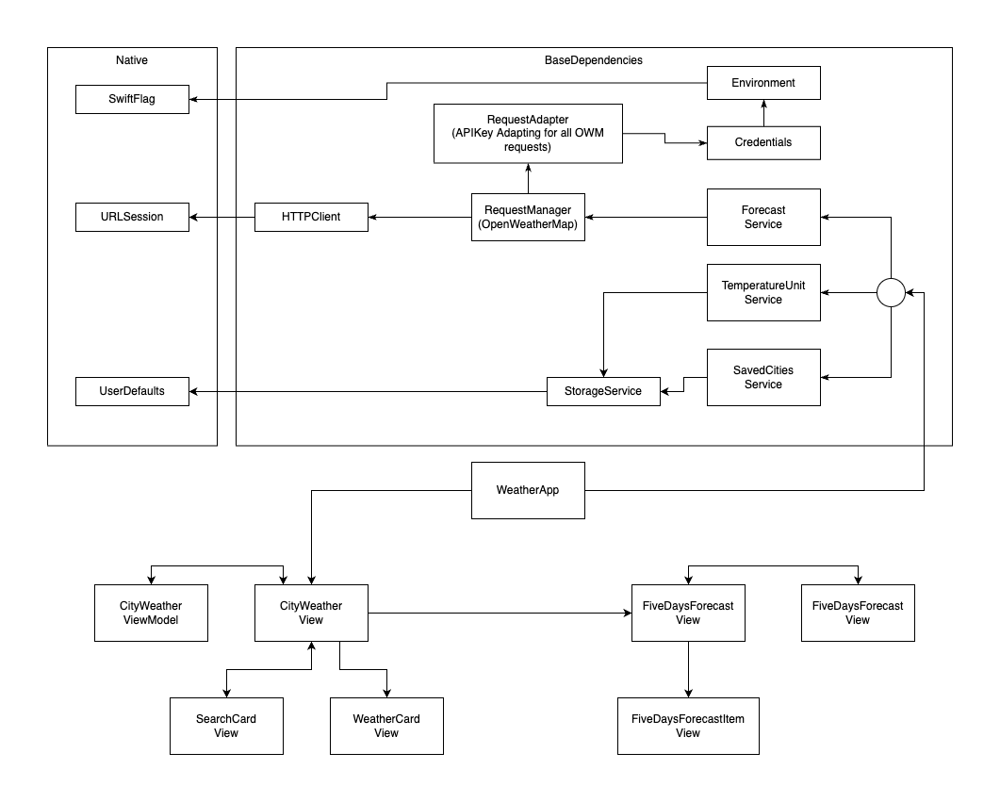
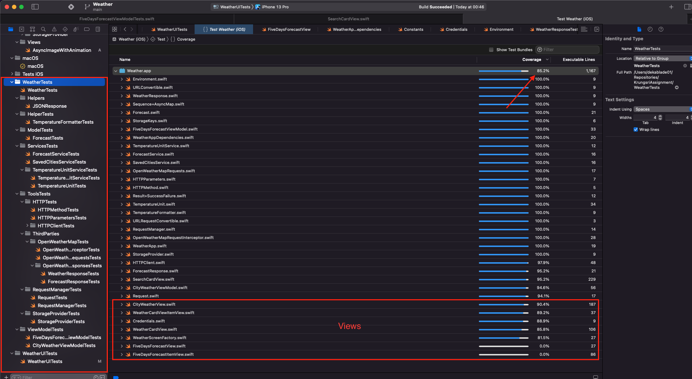
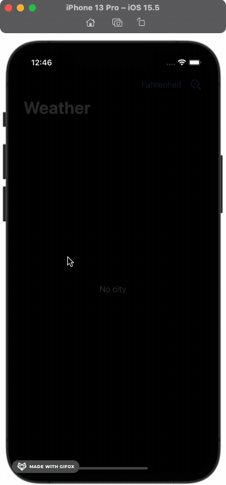

# Weather
- The Weather app allows you to add your favorite city to see the weather. 
- It shows you the current temperature in °C and °F (switchable) and humidy in percentage. 
- It can also show you the forcasts in 5 days. 

## Architecture
- The App is written in MVVM with SwiftUI Framework. 
- The API is writting with async/await. 
- The app has base dependencies, `ForecastService`, `TemperatureUnit`, and `SaveCitiesService`
- The `ForecastService` and `TemperatureUnit` are working on top of `SaveCitiesService`. 
  - The `TemperatureUnit` stores the current temperature in the storage and allows you to get `current`, `next` and `switch` the temperature unit. 
  - The `SavedCitiesService` saves an array of cities in `String` into the storage. 
  - The `ForecastService` works on top of the `RequestManager`, to format the argument of the requests and reponses to App's Model. 
- The `RequestManager` works on top of the `HTTPClient` which is a wrapper of the `URLSession`. It helps in adapting and decoding the `Data` to `ReponseModel`. 
- The `StorageService` works on top of the `UserDefaults`. It helps us in compile time safety and casting the values from the `UserDefaults`. So we don't have to remember string of raw key and type of the value to be casted to. 
- The `Credential` is a `PropertyWrapper` works on top of the `Environment` which an `Environment` works on top of `SWIFT_FLAG`
- All the things I mentioned above has protocol, so we can write the unit tests for all of them. 

## Unit Testing
- The unit test is 85.2% covered. This number includes the `SwiftUI*View.swift` too. 
- So the real number is ~ 99% covered.

## UI Testing
- The UITesting has 4 scenario
  - Launch without any city. (Assert placeholder) 
  - Add 2 cities. (Assert 2 cards of cities)
  - Relaunch the app without resetting. (Assert 2 cities are persisted)
  - Switch temperature unit. (Assert temp unit changes, and button title changes)
  - Get inside city to see 5 days forcasts.
  - The attachment below is taken from the `XCUITests` script.

## Insight
- Please note that this the APIKey is not stored in Keychain as these following reasons.
  - The APIKey is static, not fetchable like token. So it has to be stored somewhere in the project. 
    - So even store it in the Keychain, we need to have it somewhere in the project to write it to the Keychain. 
    - Normally this key should be given by an automation script or CI and buid it as part of the `.app`
- This project has none 3rd party dependency.

## Schemes
- There are 3 schemes and 3 targets. 
  - Weather
    - Weather
    - WeatherTests
  - WeatherTests
    - WeatherTests
  - WeatherUITests
    - WeatherUITests
- If you want to run UnitTests, you can run Tests on `Weather` or `WeatherTests` scheme.
- If you want to run UITests, you have to run `WeatherUITests` scheme. 